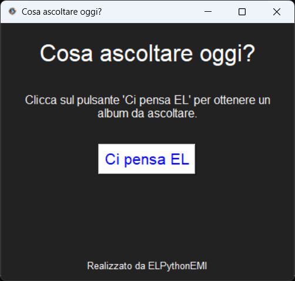

# Cosa ascoltare oggi?

Un'applicazione Python che suggerisce casualmente un album musicale da ascoltare e apre una ricerca YouTube per l'album selezionato.
[](ascolto.png)

## Caratteristiche

- Interfaccia grafica semplice e intuitiva con icona personalizzata
- Selezione casuale da una lista predefinita di album classici del rock e della musica italiana
- Apertura automatica di una ricerca YouTube per l'album selezionato

## Requisiti

- Python 3.x
- Tkinter (solitamente incluso nelle installazioni standard di Python)

## File del progetto

- `main.py`: Lo script Python principale
- `el.ico`: L'icona dell'applicazione

## Utilizzo

1. Assicurati che `main.py` e `el.ico` siano nella stessa directory
2. Esegui lo script Python:
   ```
   python main.py
   ```
3. Clicca sul pulsante "Ci pensa EL" per ottenere un suggerimento casuale.
4. Il browser si aprirà automaticamente con una ricerca YouTube dell'album suggerito.

## Autore

ELPythonEMI

